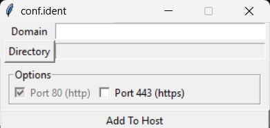

# conf.ident

A simple program to add a domain to the Windows hosts file and vhosts for XAMPP local development.

## Problem

The steps I take personally each time I start a new project:

    1. After creating laravel project inside the htdocs folder in XAMPP.
    2. Add the project's local domain to Windows' "hosts" file.
    3. Then, include the corresponding vhosts config for XAMPP.

Can I make this repetitive task simpler? this program is the result.

## How to run

    1. pipenv shell && pipenv install
    2. pyinstaller main.py -w -F -n conf.ident.exe --uac-admin --clean
    3. .\dist\conf.ident.exe

## License

[MIT](https://choosealicense.com/licenses/mit/)